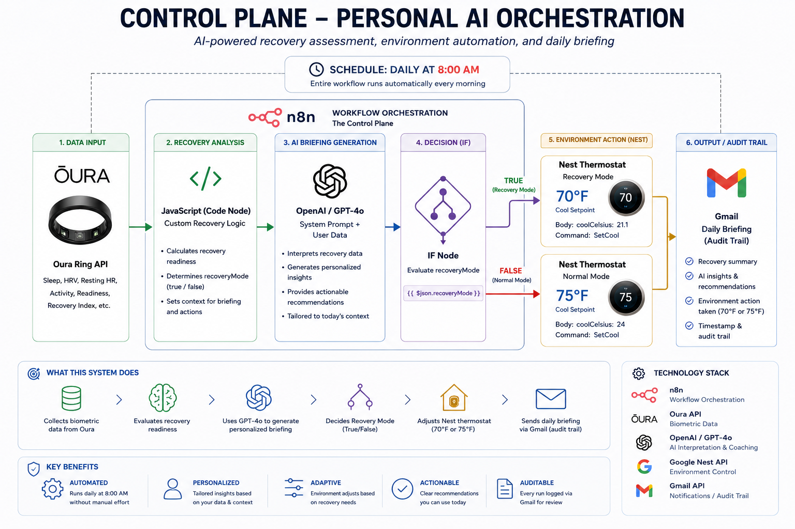

# Control Plane – Personal AI Orchestration

A personal AI control plane that combines biometric data, AI reasoning, workflow orchestration, environmental automation, and auditability.

The system runs daily at 8:00 AM and determines whether recovery should be prioritized based on Oura readiness data. It then generates an AI briefing, adjusts the home environment through Google Nest, and delivers a daily audit trail via Gmail.

---

## Architecture

The Control Plane follows an **Observe → Interpret → Decide → Act → Audit** pattern.

* **Observe** – Collect readiness and recovery signals from Oura
* **Interpret** – Evaluate recovery conditions using workflow logic
* **Decide** – Use GPT-4o to generate recommendations and determine the appropriate response
* **Act** – Adjust the home environment through Google Nest
* **Audit** – Deliver a daily briefing and execution record through Gmail

---

## The Workflow

Every morning at 8:00 AM:

1. Oura provides readiness and recovery signals
2. n8n orchestrates the workflow
3. JavaScript evaluates recovery conditions
4. GPT-4o generates a personalized daily briefing
5. Recovery Mode is determined
6. Google Nest adjusts the thermostat
7. Gmail delivers an audit trail and daily summary

---

## Technology Stack

* Oura API
* n8n
* JavaScript
* OpenAI GPT-4o
* Google Nest Device Access API
* Gmail

---

## Recovery Logic

### Recovery Mode = TRUE

* Recovery-focused recommendations
* Nest cooling setpoint: 70°F
* Prioritize sleep, mobility, hydration, and reduced training load

### Recovery Mode = FALSE

* Normal training recommendations
* Nest cooling setpoint: 75°F
* Proceed with planned training and work activities

---

## Control Plane Design

This project explores a simple but important pattern:

Observe → Interpret → Decide → Act → Audit

Rather than using AI as a standalone chatbot, the goal is to demonstrate how AI can operate as part of a governed system that combines:

* Signals
* Rules
* Reasoning
* Actions
* Transparency

---

## Why I Built This

I've been exploring the idea that the future of AI is not just better models.

The real opportunity is creating systems that combine data, orchestration, reasoning, decision logic, and action.

This project serves as a practical experiment in building a personal AI control plane.
